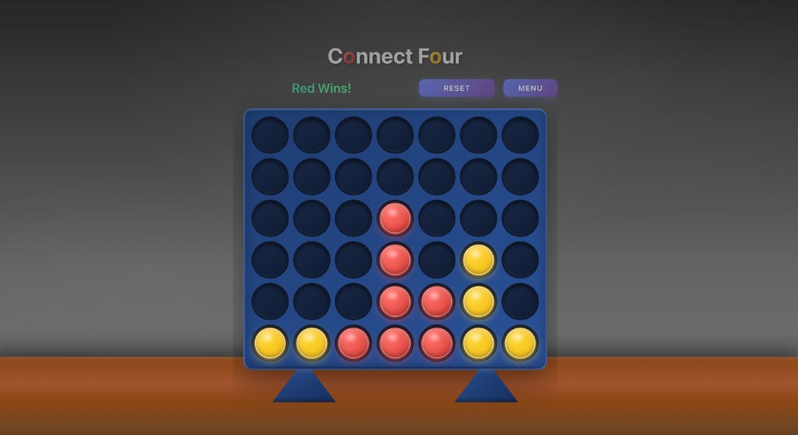

# Connect Four Game

A modern Connect Four game built with React, TypeScript, and Vite.

<div align="center">
  
</div>

## Features

- **Two game modes**: Play against a friend or challenge the computer
- **AI Difficulty Levels**: Easy, Medium, and Hard
- **Smart AI**: Hard mode uses minimax algorithm for challenging gameplay
- Win detection for all directions (horizontal, vertical, diagonal)
- Beautiful 3D visual effects with animated pieces
- Realistic board with support legs and wooden table surface
- Clean, modular component architecture
- Comprehensive unit tests
- TypeScript for type safety

## Project Structure

```
src/
├── components/           # React components
│   ├── Board.tsx        # Game board container
│   ├── Board.css
│   ├── Cell.tsx         # Individual cell/slot
│   ├── Cell.css
│   ├── GameInfo.tsx     # Current player/winner display
│   ├── GameInfo.css
│   ├── ConnectFourGame.tsx  # Main game logic
│   └── ConnectFourGame.css
├── types/               # TypeScript type definitions
│   └── game.ts
├── utils/               # Utility functions
│   ├── gameLogic.ts    # Game logic (win checking, board operations)
│   └── computerAI.ts   # AI opponent with multiple difficulty levels
├── test/                # Test configuration
│   └── setup.ts
├── App.tsx              # Root application component
└── App.css
```

## Getting Started

### Prerequisites

- Node.js version 20.19+ or 22.12+ (required for Vite 7)

### Install Dependencies

```bash
npm install
```

### Run Development Server

```bash
npm run dev
```

### Run Tests

```bash
npm test              # Run tests in watch mode
npm run test:ui       # Run tests with UI
npm run test:coverage # Run tests with coverage report
```

### Build for Production

```bash
npm run build
```

## How to Play

1. **Select Game Mode**: Choose between 2 Players or vs Computer (Easy/Medium/Hard)
2. **Drop Pieces**: Click on any column to drop your piece
3. **Win Condition**: Get 4 pieces in a row (horizontally, vertically, or diagonally)
4. **Controls**: Use Reset to restart or Menu to change game mode

## Testing

The project includes comprehensive unit tests for:

- **Game Logic** (`gameLogic.test.ts`): Tests for board creation, piece placement, and win detection
- **AI Logic** (`computerAI.test.ts`): Tests for computer opponent behavior at different difficulty levels
- **Components**: Tests for all React components ensuring proper rendering and user interactions
- **Integration Tests**: Tests for the complete game flow

All tests use Vitest and React Testing Library for modern, fast testing.
